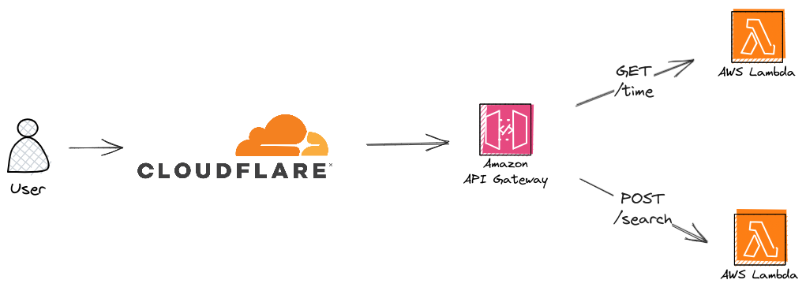

# Anime API

This is the backend API for the animeguess project.

The API utilizes an AWS serverless architecture:



## Routes
The current available routes are as followed:

### /time
This route will be a `GET` which will allow the client user to recieve the days since our first day (2023/07/01) and
the amount of time until the next day.

#### Testing the route
To test the route, you can use `CURL` to grab data from the API.
```
curl https://<api>/time
```

On success, it will return a HTTP 200 with a JSON containing:
```
{"currentDay": 6, "timeUntil": "5:07:45.864285"}
```

### /search
This route will be a `POST` with the search query. It will require the `Content-Type` header to specifically be `application/json`. It will require to have a key of `query` in order to be proper and have a value 
of length three or greater.

#### Testing the route
To test the route, you can use `CURL` to send data into the API.
```
curl -d '{"query":"Naruto"}' -H "Content-Type: application/json" -X POSThttps://<api>/search
```

On success, it will return a HTTP 200 with a JSON list of anime titles:
```
{"titles": ["Boruto: Naruto Next Generations", "Boruto: Naruto Next Generations Part 2", "Boruto: Naruto the Movie", "Naruto", "Naruto (Shinsaku Anime)", "Naruto Movie 1: Dai Katsugeki!! Yuki Hime Shinobu Houjou Dattebayo!", "Naruto Movie 2: Dai Gekitotsu! Maboroshi no Chiteiiseki Dattebayo!", "Naruto Movie 3: Dai Koufun! Mikazuki Jima no Animaru Panikku Dattebayo!",
"Naruto SD: Rock Lee no Seishun Full-Power Ninden", "Naruto Soyokazeden Movie: Naruto to Mashin to Mitsu no Onegai Dattebayo!!", "Naruto: Honoo no Chuunin Shiken! Naruto vs. Konohamaru!!", "Naruto: Shippuuden", "Naruto: Shippuuden Movie 1", "Naruto: Shippuuden Movie 2 - Kizuna", "Naruto: Shippuuden Movie 3 - Hi no Ishi wo Tsugu Mono", "Naruto: Shippuuden Movie 4 - The Lost Tower", "Naruto: Shippuuden Movie 5 - Blood Prison", "Naruto: Shippuuden Movie 6 - Road to Ninja", "The Last: Naruto the Movie"]}

```
